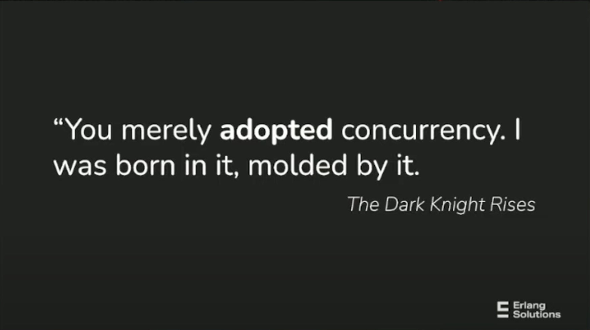
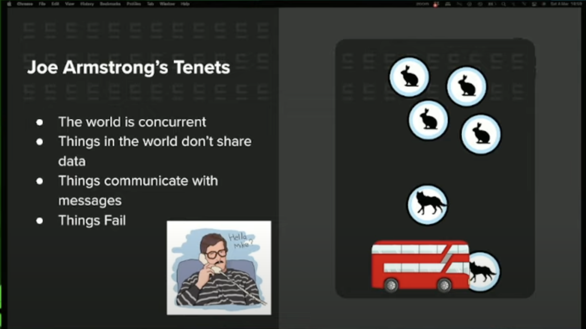

<!-- livebook:{"file_entries":[{"name":"ElixirConcurency.png","type":"attachment"},{"name":"ElixirConcurent.png","type":"attachment"},{"name":"thank.jpeg","type":"attachment"}]} -->
# Metadata

[Livebook](https://elixir-talk.fly.dev/)

<!-- livebook:{"file_entries":[{"name":"ElixirConcurency.png","type":"attachment"},{"name":"ElixirConcurent.png","type":"attachment"},{"name":"thank.jpeg","type":"attachment"}]} -->

# Elixir For Programmers

## Me - Tan Duong

* 9 Years of writing code in production
* 1 Year with Elixir
* Wrote Ruby/Python/Java/Javascript/Typescript

## Humanly

* Website: https://www.humanly.io/

* Products:

  * Screening & Scheduling via Chat UI
  * AI interview assistant

* Tech stack

  * Monolith Elixir/Phoenix
  * Frontend mixed Phoenix/LiveView/Elm

## What would you expect in a programming language?

| Category                    | My rating for Elixir |
| --------------------------- | -------------------- |
| Syntax                      | ⭐⭐⭐⭐⭐      |
| Concurrency and Parallelism | ⭐⭐⭐⭐⭐      |
| Performance                 | ⭐⭐⭐⭐         |
| Document                    | ⭐⭐⭐⭐         |
| Tooling                     | ⭐⭐⭐⭐         |
| Long-Term Viability         | ⭐⭐⭐⭐         |
| Ecosystem                   | ⭐⭐⭐            |
| Learning Curve              | ⭐⭐⭐            |
| Job                         | ⭐⭐               |

## Why Elixir?

* [How WhatsApp scaled to 1 billion users with only 50 engineers](https://www.reddit.com/r/programming/comments/qfbs22/how_whatsapp_scaled_to_1_billion_users_with_only/)
* [The Road to 2 Million Websocket Connections in Phoenix](https://www.phoenixframework.org/blog/the-road-to-2-million-websocket-connections)
* [What's your experience using Elixir?
  ](https://www.quora.com/Whats-your-experience-using-Elixir)

> It's functional, concurrent, highly scalable, super stable, offers gazzilion 9’s of reliability, has many built-in features like key/ value store for instance, pleasant Ruby-inspired syntax, fast growing number of libraries, awesomely welcoming community.

<!-- livebook:{"break_markdown":true} -->



## Elixir Pros

Elixir is a functional, concurrent, and general-purpose programming language that runs on the Erlang virtual machine (BEAM). It has gained popularity for building scalable and fault-tolerant distributed systems. Here are some of the pros of Elixir:

1. **Concurrency and Fault Tolerance:** Elixir is built on the Erlang virtual machine, which is known for its excellent concurrency support and fault tolerance mechanisms. Elixir processes are lightweight and can handle thousands of concurrent connections, making it ideal for building highly concurrent and distributed applications.

2. **Functional Programming:** Elixir is a functional programming language, which means it encourages immutable data and pure functions. This paradigm leads to more predictable code, easier debugging, and better support for parallel processing.

3. **Scalability:** Elixir's actor model and lightweight processes allow for easy scalability. Applications built with Elixir can handle a large number of simultaneous users and messages, making it suitable for building scalable web applications and real-time systems.

4. **Hot Code Swapping:** Elixir allows you to upgrade code in a running system without stopping it. This feature is crucial for applications that require high availability and cannot afford downtime during updates.

5. **Robustness and Reliability:** Elixir's design promotes fault-tolerant systems. Processes isolate errors, preventing them from affecting the entire system. Supervision trees and the "let it crash" philosophy enable the system to recover from failures gracefully.

6. **Metaprogramming:** Elixir provides powerful metaprogramming capabilities, allowing developers to write code that can generate other code dynamically. This can lead to more efficient and concise development practices.

7. **Community and Libraries:** Elixir has a growing and active community. There are numerous libraries and frameworks available for different purposes, making it easier to find solutions and get help when needed.

8. **Great Tooling:** Elixir comes with excellent tools like Mix (a build tool), ExUnit (a testing framework), and a robust package manager called Hex. These tools simplify common tasks, making development more efficient.

9. **Interoperability:** Elixir can easily interoperate with existing Erlang code and libraries. This feature is particularly useful for organizations that want to leverage their existing Erlang infrastructure while benefiting from Elixir's modern syntax and features.

10. **Functional and Concise Syntax:** Elixir's syntax is designed to be readable and expressive. It is concise and allows developers to express complex ideas in a compact and clear manner.

Overall, Elixir's combination of concurrency support, fault tolerance, scalability, and a vibrant community make it a compelling choice for building robust and distributed applications.

## Elixir Cons

While Elixir offers many advantages, it also has its limitations and challenges. Here are some of the cons associated with Elixir:

1. **Learning Curve:** Elixir's functional and concurrent programming paradigms, as well as its unique syntax, can be challenging for developers who are new to these concepts. Learning to think in terms of processes and message passing can be particularly difficult for those accustomed to imperative or object-oriented programming.

2. **Limited Talent Pool:** While the Elixir community is growing, it is still smaller than communities around more established languages. Finding experienced Elixir developers can be challenging, which can impact hiring and project timelines.

3. **Library Ecosystem:** While Elixir's library ecosystem is expanding, it may not be as extensive as those of more mainstream languages. Certain niche or specialized libraries might be missing, requiring developers to implement certain features from scratch or to find alternative solutions.

4. **Performance:** While Elixir is generally fast and highly concurrent, it might not be as performant as low-level languages like C or C++. For computationally intensive tasks, Elixir might not be the best choice without integrating optimized native code, which can be complex.

5. **Resource Intensive:** Elixir's lightweight processes are efficient, but they are not entirely free. Creating a vast number of processes can still consume memory. While the Erlang VM is optimized for handling many processes, very large-scale applications might need careful optimization and resource management.

6. **Limited IDE and Tooling Support:** While Elixir has good tooling (such as Mix and ExUnit), the support for Integrated Development Environments (IDEs) might not be as rich as in some other languages. IDE features like autocompletion and refactoring tools are not as mature as in more mainstream languages.

7. **Community and Documentation Quality:** While the Elixir community is active and helpful, the quality of community-contributed libraries and documentation can vary. Some libraries might be less well-documented or maintained compared to those in more established ecosystems.

8. **Not a One-Size-Fits-All Solution:** While Elixir is excellent for certain use cases (e.g., distributed and real-time systems), it might not be the best choice for every application. For simpler, small-scale applications, using Elixir might introduce unnecessary complexity.

9. **Maturity of Ecosystem:** While Elixir itself is stable, some libraries or frameworks might still be evolving. This can lead to issues with compatibility and stability, especially if relying on bleeding-edge technologies.

Despite these limitations, Elixir remains a powerful choice for building scalable, fault-tolerant, and concurrent applications, especially in domains like telecommunications, messaging systems, and IoT applications. Developers need to carefully consider their specific requirements and constraints when choosing Elixir for a project.

## Elixir Surprises

Elixir is a language full of surprises, especially for developers coming from more traditional programming backgrounds. Here are a few aspects of Elixir that might surprise newcomers:

1. **Immutability Everywhere:** In Elixir, variables are immutable. Once a variable holds a value, that value cannot be changed. This immutability encourages a functional programming style and can surprise developers who are used to mutable variables in languages like Java or Python.

2. **Everything is a Process:** In Elixir, everything runs inside a process. Even lightweight operations are handled by processes. This can be surprising for developers who are used to threads or other concurrency models. Elixir's processes are incredibly lightweight, so creating thousands of them is not a problem.

3. **Pattern Matching:** Elixir has powerful pattern matching capabilities. This allows for elegant and concise code, especially when dealing with complex data structures. Pattern matching can be surprising for developers unfamiliar with this feature, but it leads to expressive and readable code.

4. **Concurrency Without Shared State:** Elixir processes communicate by passing messages. This message-passing concurrency model is different from shared-state concurrency models, and it can be surprising for developers used to dealing with locks and mutexes to manage shared data.

5. **Metaprogramming:** Elixir allows for metaprogramming, which means you can write code that generates other code dynamically. This can be surprising for developers who haven't encountered metaprogramming before, and it can be a powerful tool for building abstractions and reducing boilerplate code.

6. **Functional Pipelines:** Elixir supports functional pipelines, where the output of one function becomes the input of the next. This can lead to highly readable and expressive code, especially when performing a series of transformations on data. Developers coming from languages without this feature might find it surprising how elegant and clear code can become with pipelines.

7. **Built-in Documentation:** Elixir has a built-in documentation system that is integrated into the language. Documentation is not just an afterthought; it's a fundamental part of the language and its ecosystem. This focus on documentation can be surprising, as it's not always the case in other programming languages.

8. **Interactive Development with Mix:** Elixir developers often use the Mix tool, which provides interactive development features like code reloading and an interactive shell. Being able to modify code and see changes instantly without restarting the application can be surprising and incredibly productive.

These surprises often lead to a shift in thinking for developers who are new to Elixir. Embracing these features can result in more concise, readable, and fault-tolerant code.

## Relevant skills when learning a new language

Learning a new programming language, like Elixir, offers more than just mastering its syntax; it refines your core programming skills, making you a more versatile developer. Many concepts are universal across programming languages, and acquiring these skills enhances your problem-solving abilities. Here are some key transferable skills you gain when learning a language like Elixir:

1. **Problem-Solving Skills:** Programming fundamentally involves breaking down problems and devising algorithms to solve them. This skill is essential in any language and forms the basis of all programming endeavors.

2. **Logical Thinking:** Programming languages demand logical thinking to create efficient solutions. Every language you learn sharpens your logical reasoning abilities, enabling you to approach problems systematically.

3. **Syntax Familiarity:** While syntax varies, most languages share common structures like loops, conditionals, and functions. Learning a new language teaches you how to express these structures differently, expanding your adaptability.

4. **Data Structures and Algorithms:** Understanding diverse data structures (arrays, linked lists, trees, etc.) and algorithms (sorting, searching, etc.) is universal knowledge. It's crucial for efficient coding and applicable across languages.

5. **Debugging and Troubleshooting:** Identifying and fixing errors in code is a universal skill. Proficiency in debugging techniques is crucial, regardless of the language, ensuring your ability to create robust programs.

6. **Testing:** Writing unit tests, understanding test-driven development (TDD), and ensuring code quality are skills that transcend language barriers. While specific testing frameworks may differ, the underlying principles remain consistent.

7. **Documentation:** Navigating language and framework documentation efficiently is a valuable skill. Understanding how to find relevant information and apply it in your projects is vital for seamless development.

8. **Understanding Paradigms:** Languages are categorized into different programming paradigms (object-oriented, functional, procedural, etc.). Learning a language from a different paradigm expands your programming horizons, encouraging you to approach problems from new perspectives.

9. **Problem Domain Knowledge:** Many programming tasks require understanding specific domains like web development, data science, or game development. Knowledge of domain-specific concepts (e.g., authentication/authorization, file uploads, REST APIs) enhances your programming capabilities significantly.

10. **Collaboration and Communication:** Working on projects and collaborating with other developers require effective communication and collaboration skills. Learning how to contribute, provide constructive feedback, and move projects forward are invaluable abilities in any programming environment.

By focusing on these transferable skills while learning a new language like Elixir, you not only gain proficiency in that language but also become a more adaptable, versatile, and effective programmer overall.

### Some hands on tutorials

* [Elixir Koans](https://github.com/elixirkoans/elixir-koans)
* [Replit](https://replit.com/) supported Elixir
* [How José Valim Solved Advent of Code 2021 with Elixir and LiveBook](https://youtu.be/mDxJjqx5-ns?si=L-kxwN8IS439dHCv)

### Books

* [Programming Elixir 1.6: Functional |> Concurrent |> Pragmatic |> Fun](https://pragprog.com/titles/elixir16/programming-elixir-1-6/)

### Questions to ask

* Language syntax:

  * Basic types
  * Basic operators
  * Pattern matching
  * conditional (case, cond, and if)
  * String
  * Map/Dictionary
  * Modules and Functions
  * IO and the file system
  * require and import
  * try, catch, and rescue
  * Erlang libraries
  * Debugging
  * Typespecs and behaviours

* Something maybe new with Elixir

  * Recursion
  * Enumerables and streams
  * Processes
  * Module attributes
  * Structs
  * Protocols
  * Comprehensions
  * Sigils
  * Optional syntax sheet

* Does it has what we need to build real application?

## Build Applications

* Elixir Lang: https://elixir-lang.org/
* Phoenix Framework: https://www.phoenixframework.org/
* ORM: [Ecto](https://hexdocs.pm/ecto/getting-started.html)
* Package Manager: https://hex.pm/
* Task runner: [Mix](https://elixir-lang.org/getting-started/mix-otp/introduction-to-mix.html)
* Background Job: [Oban](https://hexdocs.pm/oban/Oban.html)
* Deployment: [Phoenix Release](https://hexdocs.pm/phoenix/releases.html)

## Good part

[From Elixir creator](https://evrone.com/blog/jose-valim-interview) (rephrased)

> I had two goals: extensibility and productivity. Productivity was about focusing on having really good tooling. There are other languages, like Ruby and Go, that focus on tooling and the development experience. Extensibility boiled down to two things: Protocols to deal with polymorphism similar to Clojure and metaprogramming with Macro.

## Some syntax showcase

* Variable
* Condition
* Loop
* Function
* Module
* Pattern Matching

See: https://elixir-lang.org/getting-started/introduction.html

```elixir
# Basic datatype
IO.inspect(1, label: "integer")
IO.inspect(0x1F, label: "integer")
IO.inspect(1.0, label: "float")
IO.inspect(true, label: "boolean")
IO.inspect(:atom, label: "atom / symbol")
IO.inspect("elixir", label: "string")
IO.inspect([1, 2, 3], label: "list")
IO.inspect({1, 2, 3}, label: "tuple")
```

```elixir
# If
if nil do
  "This won't be seen"
else
  "This will"
end
```

```elixir
# Case
case {1, 2, 3} do
  {4, 5, 6} ->
    "This clause won't match"

  {1, x, 3} ->
    "This clause will match and bind x to 2 in this clause, x = #{x}"

  _ ->
    "This clause would match any value"
end
```

```elixir
# Map
map = %{:a => 1, 2 => :b}
```

```elixir
# Module, function
defmodule Math do
  def sum(a, b) do
    a + b
  end
end

Math.sum(1, 2)
```

```elixir
defmodule BinarySearch do
  def search(list, target) do
    do_search(list, target, 0, length(list) - 1)
  end

  defp do_search(_list, _target, min, max) when max < min do
    -1
  end

  defp do_search(list, target, min, max) do
    # IO.inspect("#{list}, #{target}, #{max}, #{min}")
    mid = trunc(div(min + max, 2))

    cond do
      target < Enum.at(list, mid) -> do_search(list, target, min, mid - 1)
      target > Enum.at(list, mid) -> do_search(list, target, mid + 1, max)
      target == Enum.at(list, mid) -> mid
    end
  end
end

# BinarySearch.search([1, 3, 5, 7, 11, 13, 17, 23], 15)
# |> IO.inspect(label: "Won't find anything")
list = [1, 3, 5, 7, 11, 13, 17, 23]
value = 3

index =
  BinarySearch.search(list, value)
  |> IO.inspect(label: "Will find index")

index2 =
  BinarySearch.search(list, 2)
  |> IO.inspect(label: "Won't find index")

Enum.at(list, index) == value
```

```elixir
defmodule QuickSort do
  @moduledoc """
  Implementation of QuickSort algorithm (https://en.wikipedia.org/wiki/Quicksort)

  You will be given an array of numbers, you have to sort numbers in ascending order
  using quick sort algorithm.

  Quick sort algorithm uses a divide and conquer strategy.
  It takes a pivot, and sort other numbers in functions of the pivot, divided them 
  in a smaller and a bigger group. Execute this step until there is empty list.

  Example:
   [2, 1, 5, 4, 3] 
    1. pivot:2 smaller:[1] bigger:[5, 4, 3]
    2. 2 [1] [5, 4, 3]  
    3. 2 [1] | 
             | 5 [4, 3] [] 
    4. 2 [1] | 
               | 5 | 
                   | 4 [3] []
    5. [1, 2, 3, 4, 5] # Recursion reunite all splited lists.

   [2, 1, 5, 4, 3] => [1, 2, 3, 4, 5]
  Complexity: O(n log n)
  """
  require Integer

  @doc """
    take a List and return the List with the numbers ordered
  """
  @spec sort(list(Integer)) :: list(Integer)
  def sort([]), do: []

  def sort([head | tail]) do
    smaller = Enum.filter(tail, fn x -> x <= head end) |> sort()
    bigger = Enum.filter(tail, fn x -> x > head end) |> sort()

    Enum.concat(smaller, [head]) |> Enum.concat(bigger)
  end
end

QuickSort.sort([2, 1, 5, 4, 3])
```

## Comprehension

```elixir
for n <- 1..4, do: n * n
```

```elixir
for i <- [:a, :b, :c], j <- [1, 2], do: {i, j}
```

```elixir
for <<c <- " hello world ">>, c != ?\s, into: "", do: <<c>>
```

```elixir
for {key, val} <- %{"a" => 1, "b" => 2}, into: %{}, do: {key, val * val}
```



```elixir
defmodule Messaging do
  def run() do
    parent = self()

    spawn(fn -> send(parent, {:hello, self()}) end)

    receive do
      {:hello, pid} -> IO.inspect("Got hello from #{inspect(pid)}")
    end
  end
end

Messaging.run()
```

```elixir
defmodule Parallel do
  def pmap(collection, fun) do
    collection
    |> Enum.map(fn elem ->
      Task.async(fn -> fun.(elem) end)
    end)
    |> Enum.map(fn task ->
      Task.await(task)
    end)
  end
end

result = Parallel.pmap(0..10, fn x -> x * x end)

IO.inspect(result)
```

## The bad

* Editor support is okay, not great
* Interactive debugger never worked for me
* Most likely to write API client myself
* Not as many external libraries to choose from

## Surprises

* Elixir via expose us to the complexity of the following:

  * String
  * DateTime: for example, do you know that [time can go backward](https://elixirforum.com/t/system-system-time-vs-system-os-time/48529)?

* And Erlang has built it's own world and philosophy for how to built Robust application.

* Typing is coming to Elixir and it will be great!

## Question & Discussion


